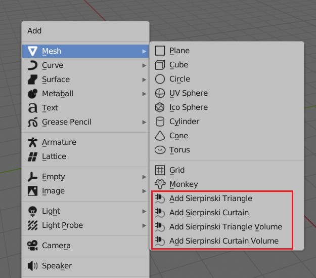
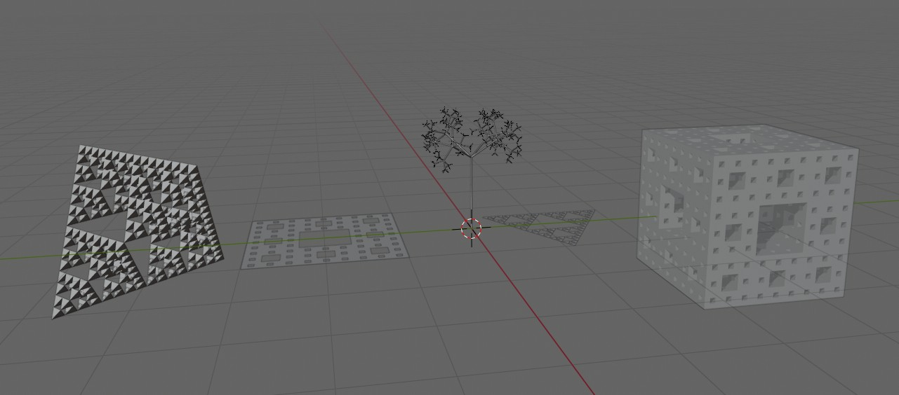

# FractalBlenderPlugin
Blender plugin for create fractal model

## included fractal model

1. Sierpiński triangle (谢尔宾斯基三角形)
2. Sierpinski carpet (谢尔宾斯基地毯)
3. Sierpiński triangle model (谢尔宾斯基三角形模型)
4. Sierpinski carpet model(谢尔宾斯基地毯模型)
5. Fractal tree(分形树)

## use method

## example

